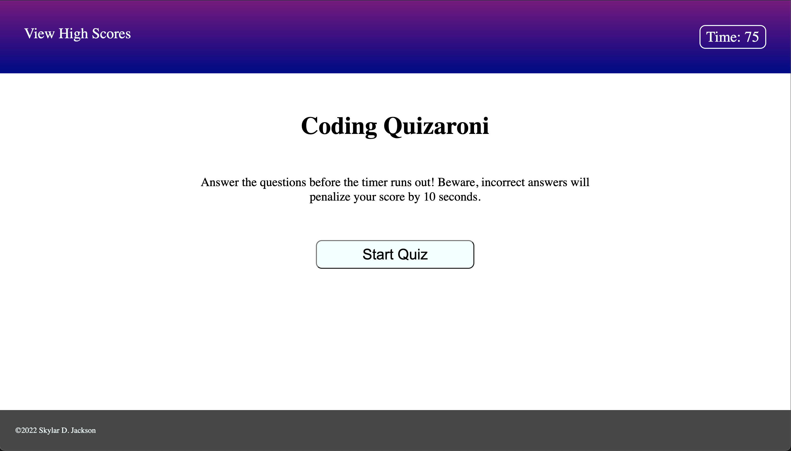

# Coding-Quiz

## **Goal:**
### *To be able build a timed quiz from scratch on JavaScript fundamentals that stores high scores.*

___

 

## Application Details
- User clicks the Start button to begin quiz, which then loads the first randomly selected question and begins a countdown timer.
- When the user answers the quesion incorrectly: 
    - the button changes color and applies strikethrough on the text
    - the timer has 10 seconds removed as a penalty
- When the user answers the question correctly, the next question and answer buttons appear.
- When all questions are answered correctly, load page to submit score and compare to other high scores.
- If timer reaches 0, alert the user the game is over and reload the page to re-start.

___

 

## Challenges Faced

- First major issue was learning how to properly set up the array of my questions and answers.
- Afterwards, I spent a large amount of time trying to fully understand how creating datasets worked, and how to use them properly.
- I really had to sit down and study how using parameters in functions worked. It still hasn't 100% clickd with me yet.

 

## *Links to GitHub repository, the active website, and a screenshot of the website:*

 

- **[Link to the GitHub Repository](https://github.com/Doctor-Worm/Coding-Quiz)**

- **[Friendly Parakeet Active Website](https://doctor-worm.github.io/Coding-Quiz/)**

 

